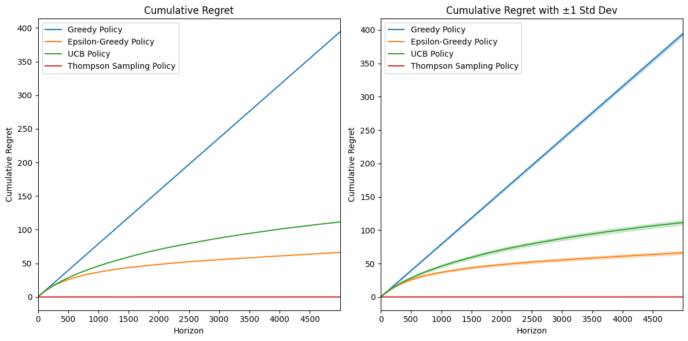
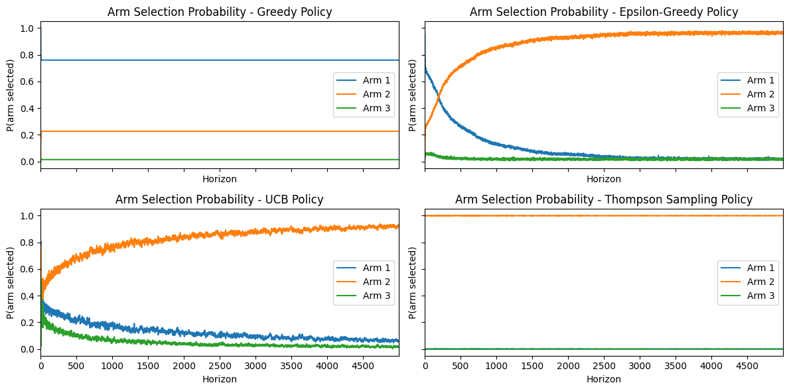
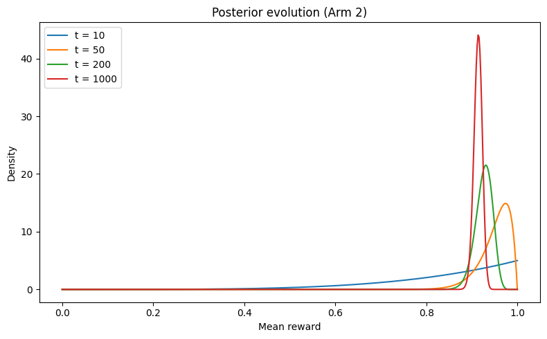
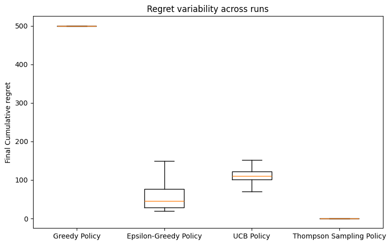

# Stochastic Multi-Armed Bandits: Regret Minimization and Bayesian Exploration

This project studies the stochastic multi-armed bandit problem with unknown reward distributions. I compare Greedy, ε-Greedy, Upper Confidence Bound(UCB) and Thompson Sampling(TS) policies, focusing on how different treatments of uncertainty affect exploration, regret and learning dynamics. Rather than treating this as an optimization problem, the emphasis is on understanding why policies behave differently under noise and limited information.

## Problem

We consider a stochastic K-armed bandit with independent arms. Each arm i produces a Bernoulli reward with unknown mean μi. At each time step, the agent selects an arm, observes a reward, and updates its policy. Performance is measured as expected cumulative regret relative to the optimal arm.

## Why Regret?

Regret measures opportunity cost of learning while acting. Unlike accuracy or reward variance, regret captures both early mistakes and long-run adaptations. A policy with low regret balances exploration and exploitation efficiently over time instead of maximizing for short-term reward.

## Policies

1. Greedy - Selects the arm with highest posterior mean. This serves as a baseline and illustrates failure mode of premature exploitation.
2. ε-Greedy - Introduces random exploration to greedy at a fixed rate. While simple, it explores indiscriminately and continues sampling clearly suboptimal arms.
3. Upper Confidence Bound (UCB) - Selects actions optimistically using upper confidence bounds derived from concentration inequalities. Exploration is forced until uncertainty is ruled out.
4. Thompson Sampling (TS) - Samples from the posterior distribution over arm means and selects the action that is optimal under the sampled hypothesis. Exploration emerges naturally in proportion to posterior uncertainty.

## Experimental Design

Experiments use a 3-armed Bernoulli bandit with carefully chosen mean rewards to expose the exploration-exploitation tradeoff. Each experiment runs for T=5000 steps and results are averaged over 1000 independent runs. All policies are evaluated on the same environments. Regret is computed using the true arm means rather than the realized rewards to isolate learning behavior from noise. We study both easy instances (large gaps betweem arm means) and harder instances (small gaps), as algorithmic behavior depends strongly on how quickly uncertainty can be resolved. In particular, finite horizon performance can differ substantially from worst-case asymptotic guarantees.

Experiments can be run from the project root using:
`python -m experiments.run_experiments`

## Results and Diagnostics

### Cumulative Regret

This figure shows mean cumulative regret over time, averaged across independent runs. Greedy suffers linear regret due to premature commitment, while ε-greedy reduces lock-in at the cost of persistent random exploration. UCB exhibits conservative exploration driven by worst-case optimism, leading to higher finite-horizon regret in this easy instance. Thompson Sampling rapidly concentrates on the optimal arm once posterior uncertainty is resolved, resulting in very low regret.

### Action Selection Behavior

We plot the fraction of times each arm is selected to illustrate how different policies allocate exploration. Greedy locks in early based on noisy estimates, ε-greedy continues sampling suboptimal arms uniformly, and UCB explores aggressively until confidence bounds shrink. Thompson Sampling allocates exploration in proportion to posterior uncertainty and naturally stops exploring once alternative arms are unlikely to be optimal.

### Posterior Evolution (Thompson Sampling)

The figure below illustrates how posterior uncertainty over an arm's mean reward collapses as data is observed. Once the probability that alternative arms are optimal becomes negligible, Thompson Sampling naturally stops exploring.

### Regret Variability

Distribution of final cumulative regret across independent runs. While Thompson Sampling achieves the lowest average regret, UCB exhibits higher variability due to prolonged exploration, reflecting the trade-off between worst-case robustness and finite-horizon performance.

## Observations

Differences between alogrithms are driven by how uncertainty is treated rather than implementation details: Greedy ignores uncertainty, ε-greedy explores indiscriminately, UCN optimizes for worst-case guarantees, and Thompson Sampling explores only when additional information is likely to change the optimal decision.

- **Greedy** often commits early to suboptimal arms due to noise in initial observations, leading to linear regret.
- **ε-Greedy** mitigates premature lock-in but explores indiscriminately, incurring a persistent regret floor from sampling clearly suboptimal arms.
- **UCB** exhibits conservative exploration driven by worst-case optimism. In easy instances with large gaps and short horizons, this can lead to higher finite-horizon regret than ε-greedy, despite stronger asymptotic guarantees.
- **Thompson Sampling** adapts exploration to posterior uncertainty. Once the probability that an alternative arms is optimal becomes negligible, exploration anturally collapses, often resulting in very low finite-horizon regret.

## Limitation \& Extensions

This study focuses on independent stochastic bandits. Extensions could exploit structure across arms (e.g. linear or contextual bandits) or examine sensitivity to prior misspecifications and heavy-tailed noise. In particular, Thompson Sampling's rapid concentration in Bernoulli bandits reflects the low noise of the reward model; higher-noise settings (e.g. Gaussian rewards) would induce longer exploration phases.

## Relation to Decision-Making under Uncertainty

Bandit problems formalize sequential decision-making under uncertainty, where actions both generate reward and reveal information. This perspective closely mirrors real-world settings such as trading, where decisions must be made before uncertainty is resolved. The contrast between UCB and Thompson Sampling highlights the difference between worst-case robustness and probability-weighted decision-making, a distinction that arises frequently in real-world trading and adaptive control problems.

